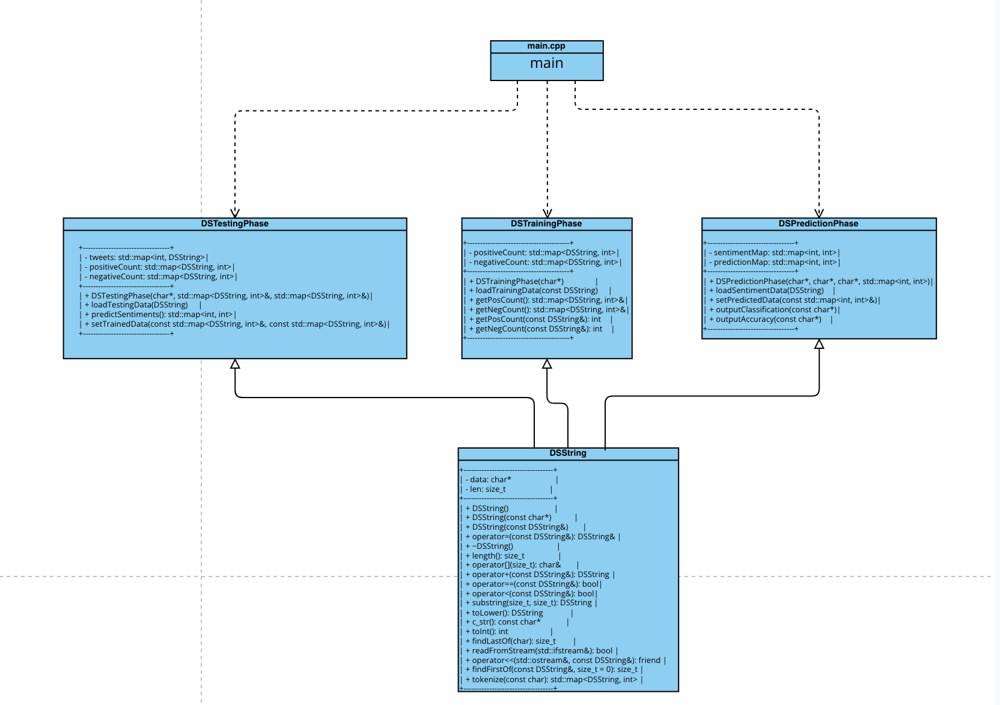

# Assignment 2: Answers

**Complete this document, commit your changes to Github and submit the repository URL to Canvas.** Keep your answers short and precise.

Your Name:

Used free extension: [ ] 24 hrs or [ ] 48 hrs

[x] Early submission (48 hrs)

[ ] Bonus work. Describe: ...

Place [x] for what applies.

## UML Diagram

Add your UML class diagram here.

Replace the following image with your diagram. You can draw it by hand and take a photo.

## Answers

1. How do you train the model and how do you classify a new tweet? Give a short description of the main steps.

   Training:
   - Read each tweet from the training dataset.
   - Tokenize the tweet into words.
   - Count the frequency of each word in positive and negative contexts.
   Classification:
   - Tokenize the new tweet into words.
   - For each word, retrieve its frequency in positive and negative contexts from the trained model.
   - Sum the frequencies for positive and negative labels.
   - Classify the tweet based on which sum (positive or negative) is higher.

2. How long did your code take for training and what is the time complexity of your training implementation (Big-Oh notation)? Remember that training includes reading the tweets, breaking it into words, counting, ... Explain why you get this complexity (e.g., what does `N` stand for and how do your data structures/algorithms affect the complexity).

   Time Taken: 782 milliseconds
   Complexity: O(N*M), where N is the number of tweets and M is the average number of words per tweet. This complexity arises because each tweet is read once, and each word in the tweet is processed individually.

3. How long did your code take for classification and what is the time complexity of your classification implementation (Big-Oh notation)? Explain why.

   Time Taken: 11 milliseconds
   Complexity: O(T*W), where T is the number of tweets to classify and W is the average number of words per tweet. This is because each tweet is tokenized into words, and each word's frequency is looked up in the trained model.

4. What accuracy did your algorithm achieve on the provides training and test data? 

   > My accuracy: 62%

   The TA will run your code on Linux and that accuracy value will be used to determine your grade.

5. What were the changes that you made that improved the accuracy the most?
   
   converting letters to lowercase.

6. How do you know that you use proper memory management? I.e., how do you know that you do not have
   a memory leak?

   ran the code with valgrind, and with TA assistance.

6. What was the most challenging part of the assignment?

   building the DSString.